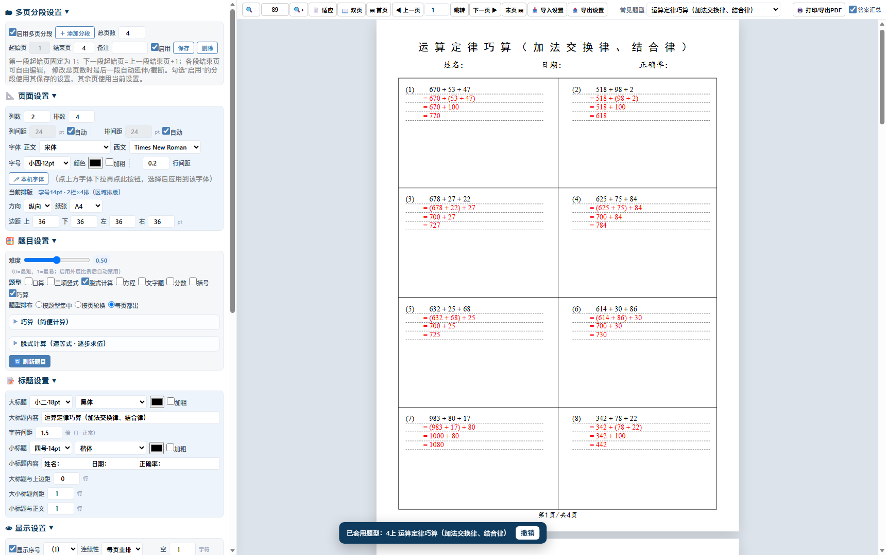
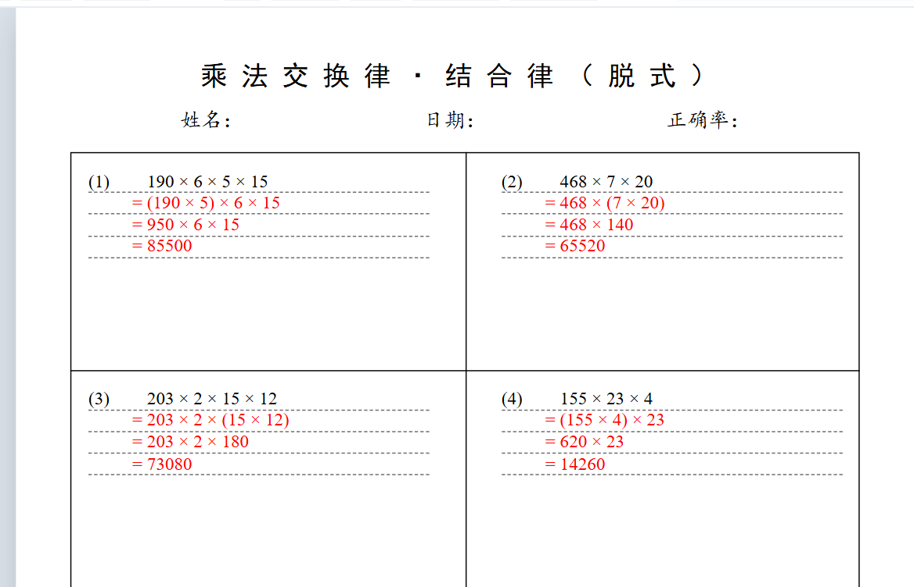
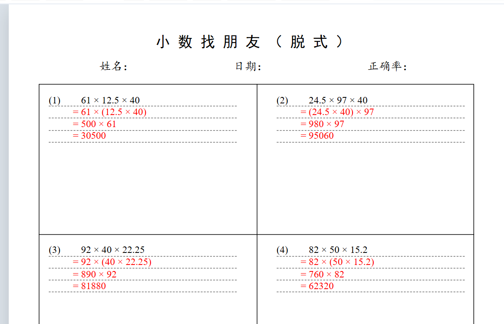

# Primary Math Worksheet Generator

> 一套面向中国小学数学（1–6 年级）的**可打印的数学计算练习卷生成器（口算|脱式|竖式|方程）**——单个 HTML 文件，双击即用，无需安装、无需联网、无需构建。

<p align="center">
  
</p>

<p align="center">
  
  
  
  
  
</p>

**English** · [简体中文](README.zh-CN.md)

---

## What is this?

A fully self-contained HTML tool that generates **printable math practice sheets** for
Chinese primary school (Grades 1–6, both semesters). It ships **131 ready-made presets**
mapped to each grade/semester, plus **32 "clever calculation" (简算) shortcut rules** —
so the generated sheets look like what a real teacher would hand out, not random numbers.

Everything runs in the browser. There is no backend, no tracking, no account.

## Sample output

<p align="center">
  
  
</p>

Left: step-by-step (脱式) problems generated from shortcut rules — every step shows the
intermediate result. Right: decimal "make-a-friend" multiplication.
Both are rendered straight from the live preview and exportable to PDF / Word.

## Features

### 1. Four problem types

| Type | 中文 | Description |
|---|---|---|
| Mental math | 口算 | Horizontal equations — *write the answer directly* |
| Column arithmetic | 二项竖式 | Two-operand vertical form for **+ − × ÷**, laid out in grid cells |
| Step-by-step | 脱式计算 | Chained expressions (递等式), solved step by step |
| Equations | 方程 | One-variable linear equations, solved in rational numbers |

The step-by-step type is powered by 32 mental-math shortcut rules, so questions are
**reverse-constructed** from a "nice number" instead of being generated randomly:

> 提公因数 · 分配律 · 加法凑整 · 减法性质 · 带符号搬家 · 乘法凑整 · 除法性质 · 接近整百拆分 ·
> 隐藏的"×1" · 接近整百加法 · 多减要加 / 多加了要减 · 基准数法 · 借一换一（等比数列）·
> 高斯配对（等差数列求和）· 提取公除数 · 去括号变号 · 积的变化规律 · 两位数乘 11 · 头同尾合十 ·
> 平方差公式 · 叠字型多位数（×101）· 裂项相消 · 小数凑整 · 小数找朋友 · 小数乘法分配律 ·
> 换元法（小数）· 商不变性质 · 分数提取公因数 · 添加因数"1" · 分数加减凑整 ·
> 分数与小数混合简算 · 尾同头合十

Each shortcut can be toggled independently.

### 2. 131 grade presets (Grades 1–6, Semester 1 & 2)

| 一年级上册 | 一年级下册 | 二年级上册 | 二年级下册 | 三年级上册 | 三年级下册 |
|---:|---:|---:|---:|---:|---:|
| 4 | 5 | 8 | 4 | 12 | 7 |

| 四年级上册 | 四年级下册 | 五年级上册 | 五年级下册 | 六年级上册 | 六年级下册 |
|---:|---:|---:|---:|---:|---:|
| 31 | 18 | 16 | 9 | 11 | 5 |

Pick a preset → the whole configuration (problem types, number ranges, decimals,
fractions, percentages, layout…) is applied at once. Undo within 12 seconds.

### 3. Print-ready layout control

- **Paper**: A3 / A4 / B5 / Letter, portrait or landscape, customizable margins, symmetric margins
- **Grid**: columns × rows, column gap, row gap, auto balancing
- **Typography**: Chinese fonts (宋体 / 黑体 / 楷体 / 仿宋 + local font picker) and
  Western fonts (Times New Roman / Arial / Georgia / Consolas / Courier New / DejaVu Mono);
  full Chinese font-size scale (初号 → 小五); bold; italic letters for variables
- **Titles**: main title, subtitle, spacing rules, letter/word spacing around math symbols
- **Pages**: page numbers (starting page, `(1)` / `（一）` / `第 X 页`), header/footer,
  watermark, per-page segmentation (＋ add segment, re-number, re-layout per page)
- **Answer tools**: answer key sheet, tutoring/try-again area, show/hide numbering
- **De-duplication**: per page / per segment / consecutive

### 4. Number & content controls

Integer digits and decimal places per operand row; per-row value ranges; quotient /
product / dividend / divisor constraints (整除, 有余, 禁止 0 或 1, 禁止末尾零); fraction
settings (真分数 / 假分数 / 最简分数); percentages; proportions; word problems.

### 5. Export

| Format | Notes |
|---|---|
| **Text-layer PDF** | Selectable/searchable text, high fidelity |
| **Image PDF** | Whole page as one image — small file, no font issues |
| **PNG / JPEG / SVG** | Single-page image export |
| **Word (.docx)** | Real OOXML generated in-browser (no library for the docx itself) |
| **ZIP** | Batch package |
| **JSON** | Export / import the *complete settings* to reproduce a sheet exactly |
| **Print** | Native browser print dialog |

Export all pages or a page range. Formula rendering uses MathJax.

## Quick start

### Option A — Just use it (recommended)

1. Download [`primary-math-worksheet-generator.html`](primary-math-worksheet-generator.html)
2. Double-click it (any modern browser: Edge / Chrome / Firefox / Safari)
3. Pick a preset on the left, hit **打印** (Print) or **开始导出** (Export)

> No install. No internet needed for generation and printing.
> Internet is only used *on demand* for PDF / image / ZIP export (JSZip, jsPDF,
> html2canvas from jsDelivr) and for MathJax formula rendering.

### Option B — Use it online (GitHub Pages)

If this repo has Pages enabled, open
`https://renxingblack.github.io/primary-math-worksheet-generator/`
— `primary-math-worksheet-generator.html` is served directly, nothing to download.

### Option C — Clone

```bash
git clone https://github.com/renxingblack/primary-math-worksheet-generator.git
cd primary-math-worksheet-generator
# then open primary-math-worksheet-generator.html in your browser
```

## Usage in 5 steps

1. **Pick a grade preset** — top-left dropdown (grouped by grade & semester), or keep
   the default and configure manually.
2. **Choose problem types** — 口算 / 二项竖式 / 脱式计算 / 方程, and how many problems
   per page (columns × rows).
3. **Set number ranges** — per-operand integer digits, decimal places, and min/max.
   Enable **巧算 / 简算** and tick the shortcut rules you want to practice.
4. **Adjust printing** — paper size, margins, columns, title, font, font size, line
   spacing, page numbers, watermark. The right-hand preview updates live.
5. **Export or print** — 打印 for a paper handout, 开始导出 for PDF / images / Word / ZIP.
   Use 导出设置 (JSON) to save a configuration and 导入设置 to reload it later.

## Repo layout

```
primary-math-worksheet-generator.html          # the entire application (single file, ~570 KB)
assets/
  screenshot.png            # full UI
  sample-shortcut-rules.png # sample output — step-by-step
  sample-decimals.png       # sample output — decimals
  social-preview.png        # 1280×640 card for repo social preview
README.md           # English
README.zh-CN.md     # 简体中文
LICENSE
```

## Tech notes

- **Single file**: one `primary-math-worksheet-generator.html` containing inlined `<style>` and an inlined IIFE
  `<script>`; ~12,000 lines / ~570 KB. No framework, no bundler, no `node_modules`.
- **Zero-dependency by design**: random generation, rational arithmetic, expression
  trees, layout computation and `.docx` (OOXML + ZIP) writing are all implemented
  from scratch in vanilla JS.
- **Optional CDN** (only when you export or need formula rendering):
  MathJax (tex-svg), jsPDF, html2canvas, JSZip.
- **UI language**: Simplified Chinese (the target users are Chinese parents & teachers).

## FAQ

**Does it need an internet connection?**
Generating and printing: no. Exporting PDF/image/Word/ZIP: yes, the first time — those
libraries are pulled from jsDelivr on demand. Afterwards the browser cache usually covers it.

**Do the questions have answers?**
Yes. Enable the answer key sheet (答案汇总) to print answers; the step-by-step problems
include every intermediate step.

**Can the questions repeat?**
Not within the configured scope — there are per-page / per-segment / consecutive
de-duplication switches.

**Is my data uploaded anywhere?**
No. Nothing leaves your browser.

## Contributing

Issues and pull requests are welcome — especially new grade presets, new shortcut rules,
or English UI localization.

## License

[MIT](LICENSE)
